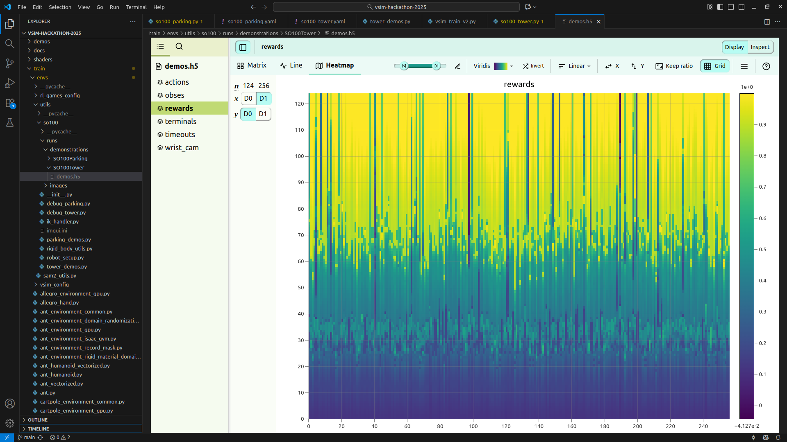
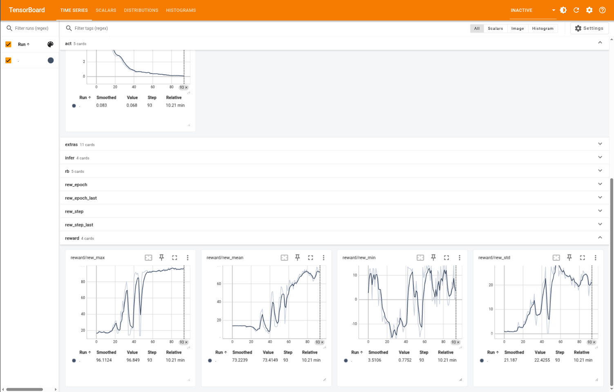

# SO100: Reward Function & Training Instructions

This guide walks you through the key steps for completing the **SO100 SAC training task** for either the **parking** or **tower** environment (although here we specifically run through the tower task, setup for parking is exactly the same). Your task is to design a reward function and train a robotic manipulation policy using demonstrations + SAC. For the purposes of using helpful extensions, we assume you are using VSCode or a similar IDE.

---

## 1. Verify Base Installation

After installing the **`vlearn`** conda environment as described in the main README, verify the installation:

```bash
python demos/101_hello_world.py
```

If the demo runs successfully, your environment is working.

---

## 2. Install Additional Dependencies for SAM2

You will also need the dependencies in the **`so100-deployment`** folder. You should already have these installed given the instructions in `hackathon.md`
These will be required later when running SAM2 for segmentation-based inference.

---

## 3. Verify Training Pipeline

Navigate to the `train` directory and run:

```bash
python vsim_train_v2.py cartpole_vision
```

As soon as the simulation begins to run, you may close the viewer.  
This ensures your core training pipeline is set up correctly.

---

## 4. Gathering Demonstrations

Demonstrations are essential for stabilizing SAC training, but they only work if your reward function is meaningful.

To view and record demonstrations for the **tower** task:

```bash
cd train/envs/utils/so100
python tower_demos.py
```

This will:

- Display the task behavior
- Record demonstrations to:  
  ```
  train/envs/utils/so100/runs/demonstrations/SO100Tower/demos.h5
  ```

If the OS pormpts you to either force quit or wait, just click wait.

Open the `.h5` file and inspect the rewards tab. (you will need the H5Web extension) 
You should aim for reward traces that start dark blue and become lighter/yellow as the episode progresses.  
This indicates increasing reward over time.

**X-axis:** Environments  
**Y-axis:** Time steps

Good demonstrations might result in a graph that looks like:


---

## 5. Editing the Reward Function

The reward function is located in:

```
train/envs/so100_tower.py
```

At the bottom of the file, find:

```python
@torch.jit.script
def compute_rewards_jit(
        # Find variables from the environment
        list,
        of,
        variables,
        rew_buf
        ):
    rew_buf.zero_()

    # Construct reward function components to teach the robot

    dummy_component = torch.zeros_like(rew_buf)

    rew_buf[:] = rew_buf + dummy_component

    return {
        "dummy component": dummy_component,
        }
```

You will:

1. Identify useful environment variables  
   - Look in:
     - `allocate_buffers`
     - `compute_observations`
     - Command handler classes

2. Create reward components scaled **between 0 and 1**

3. Use the return dictionary to track components via TensorBoard. (you will need to install the tensorbaord extension)

A good approach is to run demonstrations first, inspect how they are rewarded, and adjust your reward function to align with the gold-standard behavior. This is more the case with tower than with parking, as the demonstrations here are less precise.

Hint: turning negatives (i.e. penalties )

---

## 7. Start Training

Once your reward function is ready and demonstrations are collected:

```bash
cd train
python vsim_train_v2.py so100_tower
```

Track training via:

- The simulation viewer, or
- **TensorBoard**:

Press `Ctrl + Shift + P` in VSCode → *Launch TensorBoard*

Select:

```
runs/SO100Tower
```

A good training run might look like:



Stop training when satisfied:

```
Ctrl + C
```

---

## 8. Test Inference (Two Methods)

### **Method 1: Play mode using latest checkpoint**

Edit:

```
train/train_config/so100_tower.yaml
```

Change this block:

```yaml
mode: train
ckpt: null
```

to:

```yaml
mode: play
ckpt: runs/SO100Tower (or whatever you named your output directory)
```

---

### **Method 2: SAM2-Assisted Vision-Based Inference**

Also modify:

```yaml
envs:
  num_envs: 1
  debug: true
  use_segmentation_for_inference: true
```

[Watch the setup demo video](instruction_files/sam2-infer.mp4)

When SAM2 opens:

1. **Create 4 masks** in order:
   1. Left gripper
   2. Right gripper
   3. Box to be stacked
   4. Complete tower stack

2. Use:
   - **Left click:** Add mask points
   - **Middle click:** Finish current mask

Mask ordering matters — refer to the **`wrist_cam`** view in the `demos.h5` file for mask indexing.

[Watch the SAM2 demo video](instruction_files/sam2-annotation.mp4)

After selecting all masks:

- Close the mask selection window
- Close the preview window
- Inference will start automatically

You can inspect what the model sees:

```
train/runs/sim_images_sam2
train/runs/sim_images_rgb
```

[Watch the visualisation demo video](instruction_files/sam2-infer-vlearn.mp4)

---

## 9. Deployment to Real Robot and Vlab

Once satisfied with performance:

Copy your latest policy into:

```
so100-deployment/policies/
```

This makes it available for real-world execution.

Follow the instructions in `so100-deployment/README.md`

## Troubleshooting
### Managing GPU Memory (If Needed)

If you encounter CUDA Out-Of-Memory errors, modify:

```
train/train_config/so100_tower.yaml
```

Suggested adjustments:

```yaml
envs:
  num_envs: 128

sac:
  config:
    demonstration_ring_buffer:
      max_num_demos: 128
```

(This reduces GPU load substantially.)

---

## Error displaying '777' for motor values
If you encounter this error, unplug and plug back in the 12V power supply for the robot.
